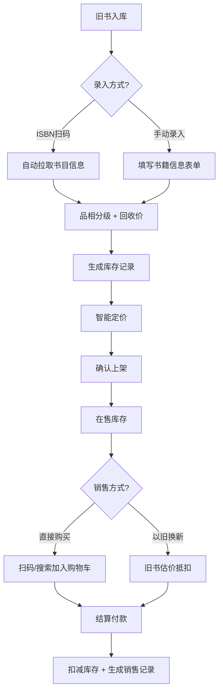

## 1. 产品概述

旧书/二手书店管理系统，专为实体二手书店打造的一站式管理工具，解决旧书入库、定价、销售、库存管理等核心业务流程。支持ISBN扫码自动获取书目信息，结合品相分级和稀缺度智能定价，帮助书店高效运营。

## 2. 核心功能

### 2.1 用户角色

| 角色 | 登录方式 | 核心权限 |
|------|----------|----------|
| 书店管理员 | 直接使用（单用户系统） | 全部功能：入库、定价、销售、以旧换新、库存管理 |

### 2.2 功能模块

1. **仪表盘首页**：数据概览、库存统计、销售趋势、快捷操作
2. **旧书入库**：ISBN扫码入库、手动录入、品相分级、回收价登记
3. **定价上架**：品相+稀缺度浮动定价、批量定价、价格调整记录
4. **销售出库**：扫码销售、购物车、收款、销售记录
5. **以旧换新**：旧书估价、折价抵扣、差价结算
6. **库存管理**：书籍列表、筛选搜索、库存盘点、下架管理

### 2.3 页面详情

| 页面名称 | 模块名称 | 功能描述 |
|----------|----------|----------|
| 仪表盘 | 数据概览 | 库存总量、在售数量、今日销售、本月营收统计卡片 |
| 仪表盘 | 快捷入口 | 入库、销售、以旧换新、库存管理快捷按钮 |
| 仪表盘 | 近期记录 | 最近入库、最近销售记录列表 |
| 旧书入库 | ISBN扫码 | 输入ISBN自动拉取书名/作者/出版社等信息 |
| 旧书入库 | 手动录入 | 完整表单录入书籍各项信息 |
| 旧书入库 | 品相分级 | 五档品相选择（全新/近新/良好/一般/较差） |
| 旧书入库 | 回收价登记 | 记录回收成本，自动计算建议售价 |
| 定价上架 | 智能定价 | 根据品相等级和稀缺度系数自动计算售价 |
| 定价上架 | 批量操作 | 批量选中书籍进行定价调整 |
| 定价上架 | 价格历史 | 记录每次价格变动及原因 |
| 销售出库 | 扫码销售 | 扫描ISBN快速添加到购物车 |
| 销售出库 | 购物车 | 商品列表、数量调整、总价计算 |
| 销售出库 | 收款结算 | 收款金额、找零、打印小票 |
| 销售出库 | 销售记录 | 历史销售查询、详情查看 |
| 以旧换新 | 旧书估价 | 扫描旧书ISBN，根据品相给出估价 |
| 以旧换新 | 抵扣结算 | 旧书折价抵新书款，多退少补 |
| 以旧换新 | 换购记录 | 历史以旧换新交易记录 |
| 库存管理 | 书籍列表 | 分页展示所有库存书籍 |
| 库存管理 | 筛选搜索 | 按书名/作者/ISBN/品相/价格区间筛选 |
| 库存管理 | 详情编辑 | 查看书籍详情、修改信息、上下架 |

## 3. 核心流程

### 3.1 旧书入库流程
书店管理员收到旧书后，可选择扫码或手动录入。扫码方式输入ISBN后，系统自动填充书目信息，管理员补充品相分级和回收价格，确认后入库并自动生成建议售价。

### 3.2 定价上架流程
入库后的书籍进入待定价状态，管理员可查看智能定价建议（基于品相等级×稀缺度系数×基础价格公式），确认或手动调整价格后，书籍状态变为在售。

### 3.3 销售出库流程
顾客选购书籍后，管理员扫描ISBN将书籍加入购物车，系统自动计算总价。顾客付款后，系统扣减库存，生成销售记录。

### 3.4 以旧换新流程
顾客带来旧书置换，管理员先对旧书进行品相评估和估价，旧书折价可抵扣新书款项。若旧书价高于新书价，退还差价；若低于，顾客补差价。旧书入库，新书出库。

## 4. 用户界面设计

### 4.1 设计风格
- **主色调**：深棕褐色（#5D4037），营造书店的温暖复古氛围
- **辅助色**：橄榄绿（#558B2F）代表新生与循环，琥珀色（#FF8F00）用于强调
- **中性色**：米白背景（#F5F0E8）、深棕文字（#3E2723）
- **按钮风格**：圆角矩形，轻微阴影，hover时有上浮效果
- **字体**：标题使用有衬线字体（思源宋体），正文无衬线（思源黑体）
- **布局风格**：左侧导航 + 右侧内容区，卡片式布局
- **图标风格**：线性图标，颜色与主题统一

### 4.2 页面设计概览

| 页面名称 | 模块名称 | UI元素 |
|----------|----------|--------|
| 仪表盘 | 数据概览 | 四张统计卡片，图标+数字+同比变化，米白卡片深棕字 |
| 仪表盘 | 快捷操作 | 四个大图标按钮，渐变背景，hover放大效果 |
| 仪表盘 | 近期记录 | 两个列表卡片，时间轴样式，交替背景色 |
| 旧书入库 | 扫码区 | 大号输入框，扫描图标按钮，实时预览卡片 |
| 旧书入库 | 表单区 | 分组表单，标签左对齐，下拉选择品相，输入框有焦点动效 |
| 定价上架 | 书籍列表 | 表格+卡片混合视图，价格高亮显示，操作按钮在右侧 |
| 销售出库 | 购物车 | 右侧抽屉式购物车，商品条目可滑动删除，底部固定结算栏 |
| 以旧换新 | 对比视图 | 左右分栏，左侧旧书信息，右侧新书信息，中间箭头+抵扣金额 |
| 库存管理 | 筛选栏 | 顶部筛选条，多条件组合，搜索框带放大镜图标 |

### 4.3 响应式
- 桌面端优先设计，适配1280px及以上宽度
- 平板端（768px-1279px）：导航收起为图标模式，内容区自适应
- 移动端（<768px）：底部导航栏，卡片单列布局，表单全宽

### 4.4 动效与交互
- 页面切换：淡入淡出过渡，150ms
- 按钮hover：背景色加深 + 轻微上移（translateY(-2px)）+ 阴影增强
- 卡片hover：阴影加深，边框颜色变化
- 表单输入：焦点时边框变主色，有过渡动画
- 数字变化：金额统计数字变化时有滚动计数效果
- 抽屉/模态框：从侧边滑入，有遮罩层
