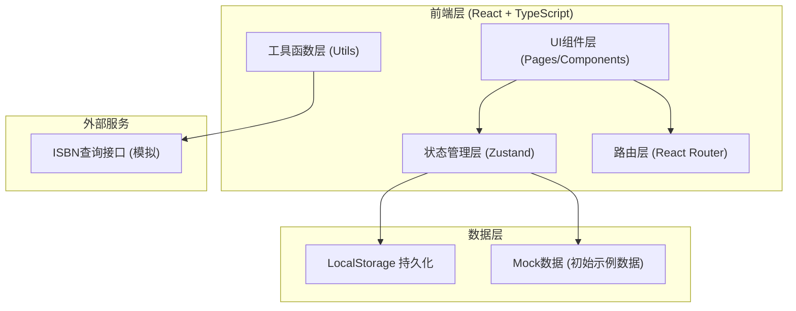
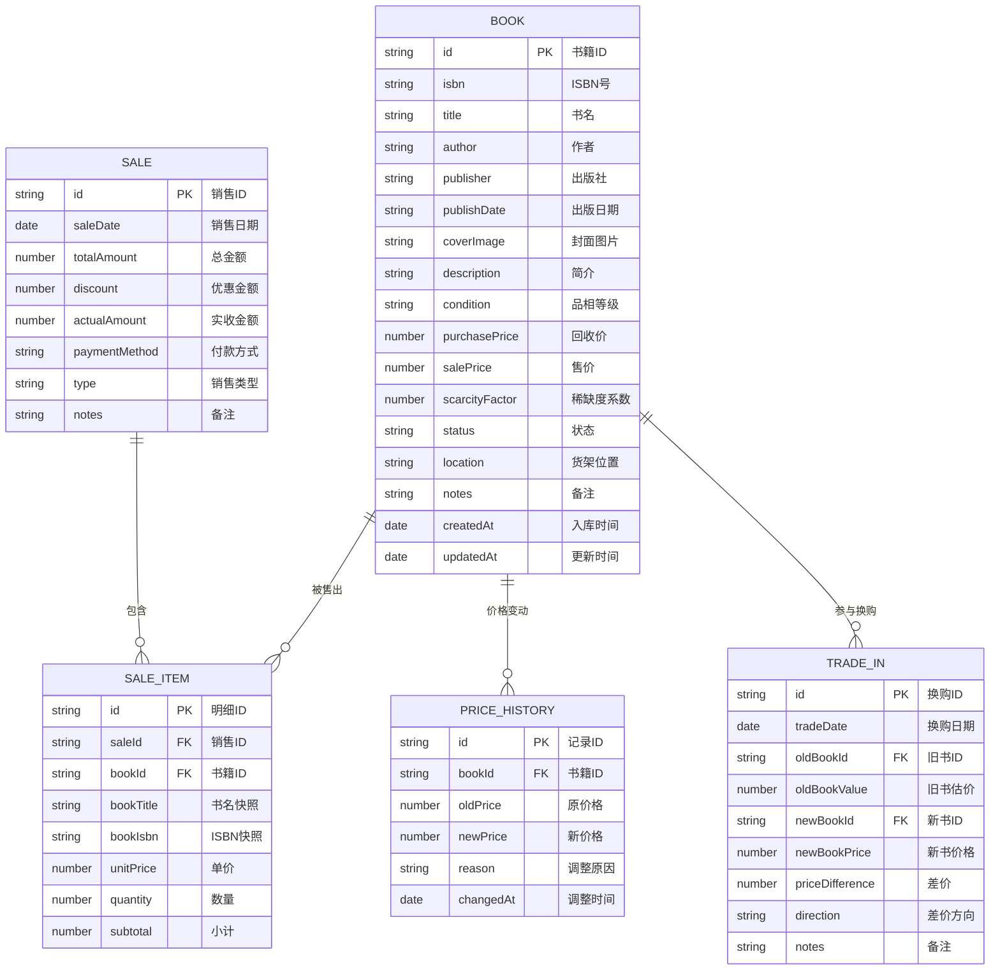

## 1. 架构设计



## 2. 技术描述

- **前端框架**：React@18 + TypeScript
- **构建工具**：Vite@5
- **样式方案**：TailwindCSS@3
- **状态管理**：Zustand@4
- **路由方案**：React Router DOM@6
- **图标库**：Lucide React
- **数据持久化**：LocalStorage
- **后端**：无（纯前端应用，数据本地存储）
- **数据库**：无（使用LocalStorage模拟）

## 3. 路由定义

| 路由路径 | 页面名称 | 用途 |
|----------|----------|------|
| / | 仪表盘 | 数据概览、快捷入口、近期记录 |
| /inventory | 库存管理 | 书籍列表、筛选搜索、详情编辑 |
| /stock-in | 旧书入库 | ISBN扫码、手动录入、品相分级 |
| /pricing | 定价上架 | 智能定价、批量操作、价格调整 |
| /sales | 销售出库 | 扫码销售、购物车、收款结算 |
| /trade-in | 以旧换新 | 旧书估价、折价抵扣、差价结算 |

## 4. 数据模型

### 4.1 数据模型定义



### 4.2 核心类型定义

```typescript
// 品相等级
type BookCondition = 'new' | 'like_new' | 'good' | 'fair' | 'poor';

// 书籍状态
type BookStatus = 'pending' | 'on_sale' | 'sold' | 'off_shelf';

// 销售类型
type SaleType = 'normal' | 'trade_in';

// 付款方式
type PaymentMethod = 'cash' | 'wechat' | 'alipay' | 'card';

interface Book {
  id: string;
  isbn: string;
  title: string;
  author: string;
  publisher: string;
  publishDate: string;
  coverImage: string;
  description: string;
  condition: BookCondition;
  purchasePrice: number;
  salePrice: number;
  scarcityFactor: number;
  status: BookStatus;
  location: string;
  notes: string;
  createdAt: string;
  updatedAt: string;
}

interface Sale {
  id: string;
  saleDate: string;
  totalAmount: number;
  discount: number;
  actualAmount: number;
  paymentMethod: PaymentMethod;
  type: SaleType;
  notes: string;
  items: SaleItem[];
}

interface SaleItem {
  id: string;
  bookId: string;
  bookTitle: string;
  bookIsbn: string;
  unitPrice: number;
  quantity: number;
  subtotal: number;
}
```

### 4.3 定价计算公式

```
基础售价 = 回收价 × 品相系数 × 稀缺度系数

品相系数:
- 全新: 2.5
- 近新: 2.0
- 良好: 1.6
- 一般: 1.3
- 较差: 1.0

稀缺度系数:
- 罕见: 1.5
- 较少: 1.3
- 普通: 1.0
- 常见: 0.8
```

## 5. 目录结构

```
src/
├── components/          # 公共组件
│   ├── Layout/         # 布局组件
│   ├── BookCard/       # 书籍卡片
│   ├── BookForm/       # 书籍表单
│   ├── ConditionBadge/ # 品相标签
│   ├── StatusBadge/    # 状态标签
│   └── SearchBar/      # 搜索框
├── pages/              # 页面组件
│   ├── Dashboard/      # 仪表盘
│   ├── Inventory/      # 库存管理
│   ├── StockIn/        # 旧书入库
│   ├── Pricing/        # 定价上架
│   ├── Sales/          # 销售出库
│   └── TradeIn/        # 以旧换新
├── store/              # 状态管理
│   ├── useBookStore.ts
│   ├── useSaleStore.ts
│   └── useUiStore.ts
├── utils/              # 工具函数
│   ├── pricing.ts      # 定价计算
│   ├── isbn.ts         # ISBN查询
│   ├── format.ts       # 格式化
│   └── storage.ts      # 本地存储
├── types/              # 类型定义
│   └── index.ts
├── data/               # 初始数据
│   └── mockBooks.ts
├── App.tsx
├── main.tsx
└── index.css
```

## 6. 状态管理设计

### 6.1 书籍状态管理 (useBookStore)
- books: Book[] - 所有书籍列表
- selectedBook: Book | null - 当前选中书籍
- 方法: addBook, updateBook, deleteBook, updatePrice, updateStatus

### 6.2 销售状态管理 (useSaleStore)
- sales: Sale[] - 销售记录
- cart: SaleItem[] - 购物车
- 方法: addToCart, removeFromCart, updateCartQuantity, clearCart, checkout

### 6.3 UI状态管理 (useUiStore)
- sidebarCollapsed: boolean - 侧边栏收起状态
- currentPage: string - 当前页面
- loading: boolean - 加载状态
- 方法: toggleSidebar, setCurrentPage
